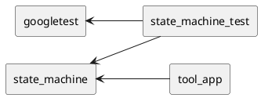

This is just a small CMake sandbox repo with cross-platoform compilation (windows/linux). It lives on Gitlab instance and uses Gitlab actions to build. It can be build and provides and install target which installs the files and exports the CMAKE config to be used by other repositories.

[TOC]

# Dependencies

- installation of cmake/ gcc on linux 
- installation of cmake and a visual studio compiler on windows
- googletest with exported path

# Overview


```
Folder structure:

root
- cmake
- source
-- state_machine
--- cmake 
--- tests
-- tool_app
```


# Setup and build googletest
```sh
git clone https://github.com/google/googletest.git -b v1.14.0
cd googletest        # Main directory of the cloned repository.
mkdir build          # Create a directory to hold the build output.
cd build 
#IF WIN
cmake .. -DCMAKE_INSTALL_PREFIX=../install -Dgtest_force_shared_crt=1  # Set install folder to PROJECT_ROOT/install
#ELSE
cmake .. -DCMAKE_INSTALL_PREFIX=../install 
#ENDIF
cmake --build . --config Release --target install  # Build release and trigger install procedure
cd ..
```

# Build repo

Setup cmake_playground
```sh 
mkdir build          # Create a directory to hold the build output.
cd build
cmake .. -DCMAKE_INSTALL_PREFIX=../install # Set install folder to PROJECT_ROOT/install
(cmake .. -DCMAKE_INSTALL_PREFIX=../install -DBUILD_SHARED_LIBS=ON) # Shared lib
cmake --build . --config Release --target install  # Build release and trigger install procedure
ctest -C Release --verbose
```

# Resources
- [CMake 3.27.6 Tutorial](https://cmake.org/cmake/help/latest/guide/tutorial/index.html)


# CI
- Running docker in docker (gitlab-runner with executor: docker)
