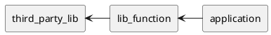

Cmake Playground
====
[TOC]

# Overview

```puml
@startuml
rectangle third_party_lib
rectangle lib_function
rectangle application
third_party_lib <- lib_function
lib_function <- application
@enduml
```

Folder structure:
- third_party_lib
- root
  - build
  - source
    - lib_function
    - wrapper
      - app
        - application
